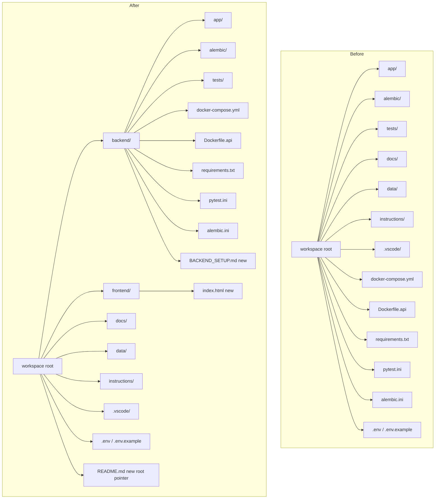
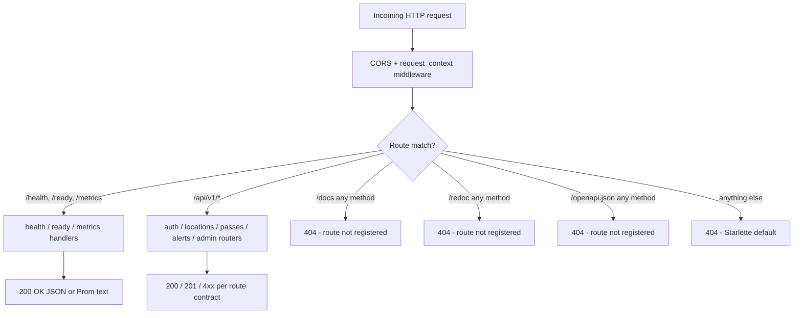

# Design Document

## Overview

This feature reorganises the Satellite Tracker repository so that every backend artifact lives under a single `backend/` directory, introduces a minimal `frontend/` placeholder, disables the public OpenAPI surface in FastAPI, and adds the documentation needed to verify a Docker-based run end to end.

The change is primarily a **file relocation + configuration update** exercise. No Python import paths change (`from app...` keeps resolving because `backend/` becomes the working directory for pytest and the Docker build context). No FastAPI route handlers change; only the `FastAPI(...)` constructor gains three `None` arguments and an inline comment. No Compose service graph changes at the topology level; only build contexts and volume source paths shift.

Design goals:

1. **Behavioural equivalence** for API, Celery, Alembic, and pytest after the move.
2. **Byte-for-byte preservation** of Python source, Alembic versions, and test files.
3. **Zero surprise** for developers: one `backend/BACKEND_SETUP.md` and one root `README.md` give a clear entry point.
4. **Docs hidden**: `/docs`, `/redoc`, and `/openapi.json` return 404 on every HTTP method.
5. **Env at root**: `.env` and `.env.example` never move; Compose and local commands reference them via `--env-file ../.env` or equivalent.

Research notes:

- FastAPI disables its OpenAPI endpoints by passing `None` for `docs_url`, `redoc_url`, and `openapi_url` to the `FastAPI` constructor ([FastAPI docs: Metadata and Docs URLs](https://fastapi.tiangolo.com/how-to/extending-openapi/)). When `openapi_url=None`, Starlette's router never registers `/docs`, `/redoc`, or `/openapi.json`, so unmatched requests fall through the router and return a 404 for every HTTP method.
- Docker Compose resolves `build.context` relative to the directory containing the compose file. Placing `docker-compose.yml` inside `backend/` with `build.context: .` automatically rebases every COPY path to the `backend/` tree, so the Dockerfile needs to copy `requirements.txt`, `app/`, and `alembic/` from within `backend/` ([Compose file reference - build](https://docs.docker.com/reference/compose-file/build/)).
- `docker compose --env-file <path>` loads variables used for interpolation in the compose file. Since the compose file here injects env values as literal `environment:` blocks (not `${VAR}` substitutions), `--env-file` affects interpolation only; container env vars are still set explicitly. Keeping `.env` at the workspace root and invoking compose from `backend/` with `--env-file ../.env` preserves the current convention ([Compose env_file and --env-file](https://docs.docker.com/compose/how-tos/environment-variables/set-environment-variables/)).
- Alembic's `script_location` is resolved relative to the directory where `alembic.ini` lives (or the CWD when invoked), and `prepend_sys_path` is a list of paths prepended to `sys.path` for `env.py` imports. Both values stay as relative paths (`alembic` and `.`) when `alembic.ini` moves into `backend/`, because the CWD during migrations is `backend/`.
- pytest's `testpaths` and `pythonpath` are rootdir-relative. With `pytest.ini` inside `backend/`, the rootdir becomes `backend/`, so `testpaths = tests` and `pythonpath = .` continue to resolve.

## Architecture

The architecture is a **layout-and-configuration change** layered on top of the existing service topology. Nothing about the runtime topology changes: the same FastAPI app, Celery worker, Celery beat, Postgres, Redis, and PgAdmin services run, with the same ports, the same env vars, and the same volume purposes.

### Before / After Directory Structure



### Compose Service Graph (After Move)

```mermaid
graph LR
  subgraph HostFS["Host: workspace root"]
    ENV[.env]
    DATA[data/]
  end

  subgraph BackendCtx["Build context: backend/"]
    DF[Dockerfile.api]
    APPSRC[app/]
    ALSRC[alembic/]
    REQ[requirements.txt]
    ALI[alembic.ini]
  end

  subgraph Compose["backend/docker-compose.yml"]
    API[api]
    CW[celery_worker]
    CB[celery_beat]
    PG[(postgres)]
    RD[(redis)]
    PGA[pgadmin]
  end

  DF -.build input.-> API
  DF -.build input.-> CW
  DF -.build input.-> CB

  ENV -. --env-file ../.env .-> API
  ENV -. --env-file ../.env .-> CW
  ENV -. --env-file ../.env .-> CB

  DATA -. ../data:/app/data .-> API
  DATA -. ../data:/app/data .-> CW
  DATA -. ../data:/app/data .-> CB

  API --> PG
  API --> RD
  CW --> PG
  CW --> RD
  CB --> PG
  CB --> RD
  PGA --> PG
```

### FastAPI Request Flow (After Docs Are Disabled)



## Components and Interfaces

### 1. File Layout Component

**Responsibility**: Move backend artifacts and create new scaffolding files.

**Moves** (byte-for-byte preserved; git mv to retain history):

| Source (workspace root) | Destination (under `backend/`) |
| --- | --- |
| `app/` | `backend/app/` |
| `alembic/` | `backend/alembic/` |
| `tests/` | `backend/tests/` |
| `docker-compose.yml` | `backend/docker-compose.yml` |
| `Dockerfile.api` | `backend/Dockerfile.api` |
| `requirements.txt` | `backend/requirements.txt` |
| `pytest.ini` | `backend/pytest.ini` |
| `alembic.ini` | `backend/alembic.ini` |

**Stays at workspace root** (unchanged):

| Path | Reason |
| --- | --- |
| `docs/` | Shared documentation |
| `data/` | Runtime volume mounted into Compose |
| `instructions/` | Workspace instructions |
| `.vscode/` | Editor settings shared by any workspace-rooted tool |
| `.env`, `.env.example` | Root-owned per Requirement 9.1 |
| `.gitignore` | Root-owned |
| `.git/` | Git internals |

**New files created**:

| Path | Purpose |
| --- | --- |
| `backend/BACKEND_SETUP.md` | Backend quickstart doc |
| `frontend/index.html` | Hello World placeholder |
| `README.md` (root) | Root pointer README |

**Modified files (content, not location)**:

| Path | Change |
| --- | --- |
| `backend/app/main.py` | Add `docs_url=None, redoc_url=None, openapi_url=None` to `FastAPI(...)` with inline comment |
| `backend/docker-compose.yml` | Volume sources change from `./data` to `../data` |
| `backend/Dockerfile.api` | No COPY path changes needed; context already aligns (see Component 3) |
| `backend/alembic.ini` | No content change needed (relative paths already resolve from `backend/`) |
| `backend/pytest.ini` | No content change needed (relative paths already resolve from `backend/`) |
| `docs/README.md` | Append Verification Pathway section |

### 2. FastAPI Configuration Component

**Responsibility**: Disable `/docs`, `/redoc`, and `/openapi.json` without touching any route handler, middleware, or router inclusion.

**Target code shape** in `backend/app/main.py`:

```python
app = FastAPI(
    title=settings.app_name,
    version=settings.app_version,
    debug=settings.debug,
    # Disable public OpenAPI surface to avoid advertising the API to
    # unauthenticated visitors. Health, ready, metrics, and /api/v1/* stay live.
    docs_url=None,
    redoc_url=None,
    openapi_url=None,
)
```

**Preserved**:

- `add_exception_handler(SatelliteTrackerError, ...)`
- `CORSMiddleware`
- `@app.middleware("http") request_context` (request ID, Prometheus counters/histograms)
- `@app.on_event("startup") init_db()`
- `@app.get("/health")`, `@app.get("/ready")`, `@app.get("/metrics")`
- All five `app.include_router(..., prefix="/api/v1")` calls

**Consequence**: With `openapi_url=None`, FastAPI skips registration of the OpenAPI route and both docs UIs. Starlette's router has no match for `/docs`, `/redoc`, or `/openapi.json` on any HTTP method, so the default 404 response is returned.

### 3. Docker Component

#### Dockerfile.api

The current Dockerfile copies:

```dockerfile
COPY requirements.txt .
COPY app ./app
COPY alembic ./alembic
COPY alembic.ini .
```

After the move, the Docker build context becomes `backend/` (because `backend/docker-compose.yml` sets `build.context: .`). The paths `requirements.txt`, `app`, `alembic`, and `alembic.ini` are all present at the root of that new context, so **no COPY paths change**. The Dockerfile is effectively location-neutral.

Target `backend/Dockerfile.api` (unchanged semantics):

```dockerfile
FROM python:3.11-slim
WORKDIR /app
ENV PYTHONDONTWRITEBYTECODE=1 PYTHONUNBUFFERED=1
RUN apt-get update && apt-get install -y --no-install-recommends curl gcc libpq-dev && rm -rf /var/lib/apt/lists/*
COPY requirements.txt .
RUN pip install --no-cache-dir -r requirements.txt
COPY app ./app
COPY alembic ./alembic
COPY alembic.ini .
EXPOSE 8000
CMD ["sh", "-c", "alembic upgrade head && uvicorn app.main:app --host 0.0.0.0 --port 8000"]
```

#### docker-compose.yml

Key changes:

1. `build.context: .` keeps working because the compose file is now inside `backend/`, so `.` = `backend/`.
2. `dockerfile: Dockerfile.api` path unchanged (lives next to the compose file).
3. Volume sources change from `./data:/app/data` to `../data:/app/data` because `data/` stays at the workspace root.
4. `depends_on`, `healthcheck`, ports, environment blocks, and service names all stay identical.

Target `backend/docker-compose.yml` (diff relative to current):

```yaml
# unchanged services: postgres, redis, pgadmin

  api:
    build:
      context: .           # now resolves to backend/
      dockerfile: Dockerfile.api
    # ... env unchanged ...
    volumes:
      - ../data:/app/data  # was ./data:/app/data

  celery_worker:
    build:
      context: .
      dockerfile: Dockerfile.api
    # ...
    volumes:
      - ../data:/app/data

  celery_beat:
    build:
      context: .
      dockerfile: Dockerfile.api
    # ...
    volumes:
      - ../data:/app/data
```

#### Env File Convention

`.env` and `.env.example` stay at the workspace root. Two developer entry points:

- **From `backend/`**: `docker compose --env-file ../.env up --build`. The `--env-file` flag points compose at the root `.env` for any interpolation it performs.
- **From workspace root**: `docker compose -f backend/docker-compose.yml --env-file .env up --build`. Equivalent behaviour.

Because the compose file sets `environment:` blocks explicitly (not `${VAR}` references), container env values are not currently driven by `.env`. The `--env-file` flag is recorded as the convention so future `${VAR}` substitutions continue to work without surprises.

Local (non-Docker) processes continue to read `.env` via `pydantic-settings` (`Settings.model_config.env_file = ".env"`). Running from the workspace root picks it up automatically. Running from `backend/` requires either:

- `cd` to the workspace root before launching uvicorn/celery, or
- invoking with `--env-file ../.env` for commands that support it.

`BACKEND_SETUP.md` documents both conventions.

### 4. Alembic and pytest Configuration Component

#### alembic.ini

Current values:

```ini
script_location = alembic
prepend_sys_path = .
```

Both are relative to the directory containing `alembic.ini`. After the move, `alembic.ini` lives in `backend/`, so:

- `script_location = alembic` resolves to `backend/alembic/` ✅
- `prepend_sys_path = .` prepends `backend/` to `sys.path`, which makes `from app...` resolvable ✅

**No content change required.**

#### alembic/env.py

The only workspace-aware code is `from app.config import get_settings` and `from app.database import Base`. Because `prepend_sys_path = .` (i.e., `backend/`) makes `app` importable, these imports keep resolving. **No changes required to `env.py`.**

#### pytest.ini

Current values:

```ini
[pytest]
testpaths = tests
pythonpath = .
asyncio_mode = auto
addopts = -v --tb=short
```

After the move, `pytest.ini` lives in `backend/`, so:

- `testpaths = tests` resolves to `backend/tests/` ✅
- `pythonpath = .` prepends `backend/` to `sys.path`, preserving `from app...` imports in tests ✅

**No content change required.**

#### Runtime invariant

Because `backend/` becomes:

- The Docker build context (everything copies into `/app` in the image, where `app/` is a subdirectory, so `uvicorn app.main:app` resolves).
- The CWD for `alembic upgrade head` (the Dockerfile CMD runs from `WORKDIR /app`, which is a direct mirror of `backend/`, so `alembic.ini` and `alembic/` are both reachable).
- The rootdir for pytest (developers run `pytest` from `backend/`).

...the `from app...` import path is stable in all three execution contexts.

### 5. Frontend Placeholder Component

**Responsibility**: Reserve the `frontend/` directory with a standards-compliant placeholder. No build tooling, no Compose wiring.

`frontend/index.html`:

```html
<!DOCTYPE html>
<html lang="en">
  <head>
    <meta charset="UTF-8">
    <title>Satellite Tracker</title>
  </head>
  <body>
    <h1>Hello World</h1>
  </body>
</html>
```

No `package.json`, no bundler config, no reference from `docker-compose.yml`. A future feature will add those.

### 6. Documentation Component

#### `backend/BACKEND_SETUP.md` (new)

Section outline:

1. **Overview** - one-paragraph summary of what lives in `backend/`.
2. **Docker Compose quickstart**
   - `cd backend`
   - `docker compose --env-file ../.env up --build`
   - Note: run from `backend/` because compose file lives there.
3. **Fixed host ports**
   - API: `8000`
   - Postgres: `5432`
   - Redis: `6379`
   - PgAdmin: `5050`
4. **Health and metrics URLs** (with Compose up)
   - `http://localhost:8000/health`
   - `http://localhost:8000/ready`
   - `http://localhost:8000/metrics`
5. **Disabled docs note**
   - `/docs`, `/redoc`, `/openapi.json` return 404 on purpose.
   - Use `curl` or the frontend to exercise `/api/v1/*`.
6. **Local Python setup**
   - `cd backend`
   - `python -m venv .venv && source .venv/bin/activate`
   - `pip install -r requirements.txt`
   - `alembic upgrade head` (requires Postgres running or a local DB configured via `../.env`)
7. **Local run commands** (three terminals)
   - API: `uvicorn app.main:app --reload`
   - Worker: `celery -A app.tasks:celery_app worker --loglevel=info`
   - Beat: `celery -A app.tasks:celery_app beat --loglevel=info`
8. **Env file convention**
   - `.env` and `.env.example` live at the workspace root.
   - Docker: `--env-file ../.env` from `backend/`.
   - Local: run from the workspace root, or set `ENV_FILE=../.env` if needed.
9. **Data volume**
   - TLE cache writes to `data/stations.tle` at the workspace root via the `../data:/app/data` mount.

#### Root `README.md` (new)

Section outline:

1. **What this repo contains** - one paragraph pointing at `backend/`, `frontend/`, `docs/`.
2. **Where to start**
   - Developers running the backend: see `backend/BACKEND_SETUP.md`.
   - Developers reading the project overview and API list: see `docs/README.md`.
   - Frontend placeholder: `frontend/index.html`.
3. **Top-level layout** - short tree.

#### `docs/README.md` (append Verification Pathway)

New section appended at the end:

```markdown
## Verification Pathway

After `docker compose --env-file ../.env up --build` from `backend/`:

1. Health check:
   curl http://localhost:8000/health
   Expected JSON:
   { "status": "healthy", "version": "1.0.0", "timestamp": "2024-01-01T00:00:00+00:00" }

2. Readiness: curl http://localhost:8000/ready -> { "ready": true, ... }
3. Metrics: curl http://localhost:8000/metrics -> Prometheus text format.
4. Docs disabled: curl -i http://localhost:8000/docs -> HTTP/1.1 404.
   curl -i http://localhost:8000/redoc -> HTTP/1.1 404.
   curl -i http://localhost:8000/openapi.json -> HTTP/1.1 404.
5. PgAdmin at http://localhost:5050 (admin@tracker.local / admin).
```

## Data Models

This feature introduces no new runtime data models. The existing SQLAlchemy models (`app/models.py`), Pydantic schemas (`app/schemas.py`), and Alembic migration (`alembic/versions/001_initial_schema.py`) move byte-for-byte and continue to define the same tables.

The only "data model" introduced here is a **file relocation manifest**, which drives Requirement 10's verification and the task list in the next phase.

### File Relocation Manifest

```typescript
type FileMove = {
  src: string;          // workspace-relative path before move
  dst: string;          // workspace-relative path after move
  mode: "move" | "create" | "modify" | "append";
  mustPreserveBytes: boolean;
};

const manifest: FileMove[] = [
  { src: "app/",                dst: "backend/app/",                mode: "move",   mustPreserveBytes: true  },
  { src: "alembic/",            dst: "backend/alembic/",            mode: "move",   mustPreserveBytes: true  },
  { src: "tests/",              dst: "backend/tests/",              mode: "move",   mustPreserveBytes: true  },
  { src: "requirements.txt",    dst: "backend/requirements.txt",    mode: "move",   mustPreserveBytes: true  },
  { src: "pytest.ini",          dst: "backend/pytest.ini",          mode: "move",   mustPreserveBytes: true  },
  { src: "alembic.ini",         dst: "backend/alembic.ini",         mode: "move",   mustPreserveBytes: true  },
  { src: "Dockerfile.api",      dst: "backend/Dockerfile.api",      mode: "move",   mustPreserveBytes: true  },
  { src: "docker-compose.yml",  dst: "backend/docker-compose.yml",  mode: "move",   mustPreserveBytes: false }, // volumes updated
  { src: "(none)",              dst: "backend/app/main.py",         mode: "modify", mustPreserveBytes: false }, // docs_url=None etc.
  { src: "(none)",              dst: "backend/BACKEND_SETUP.md",    mode: "create", mustPreserveBytes: false },
  { src: "(none)",              dst: "frontend/index.html",         mode: "create", mustPreserveBytes: false },
  { src: "(none)",              dst: "README.md",                   mode: "create", mustPreserveBytes: false },
  { src: "docs/README.md",      dst: "docs/README.md",              mode: "append", mustPreserveBytes: false }, // verification pathway
];
```

### Endpoint Contract Snapshot

```typescript
type EndpointContract = {
  method: "GET" | "POST" | "PATCH" | "DELETE";
  path: string;
  status: "preserved" | "404_after";
};

const preservedEndpoints: EndpointContract[] = [
  { method: "GET",    path: "/health",                             status: "preserved" },
  { method: "GET",    path: "/ready",                              status: "preserved" },
  { method: "GET",    path: "/metrics",                            status: "preserved" },
  // /api/v1/auth/*
  { method: "POST",   path: "/api/v1/auth/register",               status: "preserved" },
  { method: "POST",   path: "/api/v1/auth/login",                  status: "preserved" },
  { method: "POST",   path: "/api/v1/auth/refresh",                status: "preserved" },
  { method: "POST",   path: "/api/v1/auth/logout",                 status: "preserved" },
  { method: "GET",    path: "/api/v1/auth/me",                     status: "preserved" },
  // /api/v1/locations/*
  { method: "GET",    path: "/api/v1/locations",                   status: "preserved" },
  { method: "POST",   path: "/api/v1/locations",                   status: "preserved" },
  { method: "GET",    path: "/api/v1/locations/{location_id}",     status: "preserved" },
  { method: "PATCH",  path: "/api/v1/locations/{location_id}",     status: "preserved" },
  { method: "DELETE", path: "/api/v1/locations/{location_id}",     status: "preserved" },
  // /api/v1/passes/*
  { method: "GET",    path: "/api/v1/passes",                      status: "preserved" },
  { method: "POST",   path: "/api/v1/passes/refresh",              status: "preserved" },
  { method: "GET",    path: "/api/v1/passes/stats",                status: "preserved" },
  { method: "GET",    path: "/api/v1/passes/{pass_id}",            status: "preserved" },
  { method: "GET",    path: "/api/v1/satellites",                  status: "preserved" },
  // /api/v1/alerts/*
  { method: "GET",    path: "/api/v1/alerts",                      status: "preserved" },
  { method: "POST",   path: "/api/v1/alerts",                      status: "preserved" },
  { method: "GET",    path: "/api/v1/alerts/history",              status: "preserved" },
  { method: "GET",    path: "/api/v1/alerts/stats",                status: "preserved" },
  { method: "GET",    path: "/api/v1/alerts/{alert_id}",           status: "preserved" },
  { method: "PATCH",  path: "/api/v1/alerts/{alert_id}",           status: "preserved" },
  { method: "DELETE", path: "/api/v1/alerts/{alert_id}",           status: "preserved" },
  // /api/v1/admin/*
  { method: "GET",    path: "/api/v1/admin/stats",                 status: "preserved" },
  { method: "GET",    path: "/api/v1/admin/job-status",            status: "preserved" },
  { method: "GET",    path: "/api/v1/admin/job-status/{task_id}",  status: "preserved" },
  { method: "GET",    path: "/api/v1/admin/users",                 status: "preserved" },
  { method: "PATCH",  path: "/api/v1/admin/users/{user_id}/active",status: "preserved" },
  { method: "POST",   path: "/api/v1/admin/cleanup",               status: "preserved" },
];

const four_oh_four_after: EndpointContract[] = [
  { method: "GET",    path: "/docs",         status: "404_after" },
  { method: "POST",   path: "/docs",         status: "404_after" },
  { method: "GET",    path: "/redoc",        status: "404_after" },
  { method: "POST",   path: "/redoc",        status: "404_after" },
  { method: "GET",    path: "/openapi.json", status: "404_after" },
  { method: "POST",   path: "/openapi.json", status: "404_after" },
];
```


## Correctness Properties

*A property is a characteristic or behavior that should hold true across all valid executions of a system — essentially, a formal statement about what the system should do. Properties serve as the bridge between human-readable specifications and machine-verifiable correctness guarantees.*

Property-based testing is appropriate here because this feature has several invariants that quantify over well-defined finite sets (the move manifest, the route manifest, the cross-product of HTTP methods × doc-endpoint path variants, the backend module tree, and the compose service list). Each property is cheap to evaluate in-process (no AWS, no real docker daemon for the HTTP/route/import properties), and input variation exposes real regressions: a missed move, a silently re-enabled `/docs` route, an import that broke when a file was shuffled, a volume or env_file entry that was half-migrated.

Properties that could not be expressed as "for all X, P(X) holds" (doc content substrings, single-endpoint contract checks for `/health` and `/ready`, tooling smoke checks) are captured as example-based or smoke tests in the Testing Strategy section instead.

### Property 1: Move Manifest Consistency

*For any* entry `(src, dst)` in the canonical move manifest FILE_MOVES, after the restructure the path `dst` exists (as a file or directory, matching the source's kind) and the path `src` no longer exists at the workspace root; and *for any* entry in FILES_UNCHANGED_LOCATION, the path still exists at the workspace root and no identically-named shadow copy exists inside `backend/`.

**Validates: Requirements 1.2, 1.3**

### Property 2: API Route Parity Under `/api/v1`

*For any* `(method, path)` pair in the pre-move reference route manifest for `/api/v1/*`, the live post-move FastAPI app registers a matching route with that exact method and path; and *for any* `(method, path)` under `/api/v1/*` registered on the live app, that pair is present in the reference manifest. The manifest captures `auth`, `locations`, `passes`, `satellites`, `alerts`, and `admin` routes as listed in `docs/README.md`.

**Validates: Requirements 2.1, 3.7, 10.4**

### Property 3: Hidden Documentation Endpoints Return 404

*For any* HTTP method `m` in `{GET, POST, PUT, PATCH, DELETE, HEAD, OPTIONS}` and *for any* path variant `p` in `{"/docs", "/docs/", "/redoc", "/redoc/", "/openapi.json", "/openapi.json/"}`, the live FastAPI app returns HTTP status `404` for `m p`, and the response does not contain HTML bodies that would be emitted by Swagger UI or ReDoc.

**Validates: Requirements 3.1, 3.2, 3.3, 3.4, 3.5, 10.5**

### Property 4: Compose Service Structural Invariants

*For any* Python service `s` in `{"api", "celery_worker", "celery_beat"}` defined in `backend/docker-compose.yml`, after the restructure:

- `s.env_file` includes `../.env`,
- `s.volumes` contains a bind mount whose host side resolves to the workspace root `data/` directory (i.e., `../data`) and whose container side begins with `/app/data`,
- `s.depends_on` includes `postgres` and `redis` with `condition: service_healthy`,
- `s.build.context` resolves to `backend/` (i.e., `.` when the compose file lives in `backend/`) and `s.build.dockerfile` is `Dockerfile.api`.

And *for any* service `s'` in `{"api": 8000, "postgres": 5432, "redis": 6379, "pgadmin": 5050}`, the compose file publishes the indicated host port on `s'`.

**Validates: Requirements 4.1, 4.3, 4.4, 4.5, 9.4**

### Property 5: Backend Module Import Health

*For any* Python module path `m` under `backend/app/` (every `.py` file in the package, including `app`, `app.routers.*`, and sibling modules), invoking `importlib.import_module(m)` with CWD set to `backend/` and `backend/` on `sys.path` completes without raising `ImportError` or `ModuleNotFoundError`.

**Validates: Requirements 2.1, 2.6, 2.7, 8.4**

## Error Handling

This feature changes organization, not error semantics. The application-level error handlers — `SatelliteTrackerError` → `satellite_tracker_exception_handler` registration in `app/main.py`, FastAPI's default validation error handler, and router-level `HTTPException` raises — are preserved byte-for-byte.

Three new error surfaces are introduced by the restructure itself:

1. **Missing `.env` at the workspace root.**
   - Symptom during `docker compose up`: compose warns that `env_file ../.env` is missing. Service startup still proceeds using the inline `environment:` block in the compose file.
   - Symptom during local dev: `pydantic-settings` loads defaults from `Settings` field definitions (all fields have working defaults) and proceeds.
   - Mitigation: `BACKEND_SETUP.md` tells the developer to `cp ../.env.example ../.env` if `.env` is missing, and to create the `backend/.env -> ../.env` symlink.

2. **Missing `backend/.env` symlink on the developer's machine.**
   - Symptom: local processes silently use default settings, potentially with `DATABASE_URL` pointing to `localhost:5432` even when the developer meant to use a non-default DB.
   - Mitigation: the setup doc calls the symlink step out as step 1. On Windows, a documented `cp` fallback is given.

3. **Leftover `/docs`, `/redoc`, or `/openapi.json` caches in a browser bookmark.**
   - Symptom: a developer who had `http://localhost:8000/docs` bookmarked sees a 404.
   - Mitigation: the Verification Pathway explicitly calls this out as expected behavior.

The feature does not add new raised exceptions. The only configuration-error paths are caught by existing middleware (CORS, request-context) and existing exception handlers.

## Testing Strategy

### Scope

Five correctness properties (Properties 1–5 above) are implemented as property-based tests. Everything else is covered by targeted example tests or single-run smoke tests. This feature does not warrant a large PBT harness because most acceptance criteria are structural one-shots (file existed; comment present; doc contains string).

### Property-Based Tests

Implemented with `hypothesis` (already compatible with `pytest` 8.x, fits the existing Python 3.11 toolchain). Each property test runs a minimum of 100 iterations and is tagged with a comment of the form `# Feature: backend-frontend-restructure, Property N: <property text>`.

| Property | Test file (proposed)                              | Generators                                                              |
| -------- | ------------------------------------------------- | ----------------------------------------------------------------------- |
| 1        | `backend/tests/test_restructure_layout.py`        | `sampled_from(FILE_MOVES)`, `sampled_from(FILES_UNCHANGED_LOCATION)`    |
| 2        | `backend/tests/test_restructure_routes.py`        | `sampled_from(REFERENCE_ROUTE_MANIFEST)` and dynamic enumeration of `app.routes` |
| 3        | `backend/tests/test_restructure_hidden_docs.py`   | `sampled_from(HTTP_METHODS) × sampled_from(DOC_PATH_VARIANTS)`          |
| 4        | `backend/tests/test_restructure_compose.py`       | `sampled_from(["api", "celery_worker", "celery_beat"])` for per-service checks; separate test for port map |
| 5        | `backend/tests/test_restructure_imports.py`       | `sampled_from(backend_app_modules())` (enumerated via `pkgutil.walk_packages`) |

Iteration count: `hypothesis.settings(max_examples=100)` on each strategy. For properties whose input space is smaller than 100 (e.g., Property 3's 7 × 6 = 42 combinations, Property 1's fewer than 20 entries), Hypothesis will enumerate the full space deterministically; the `max_examples=100` setting is the upper bound, not a requirement to hit 100 distinct inputs.

### Example and Smoke Tests

- **Health contract** (Requirement 2.2): one `TestClient` call to `GET /health`; assert keys.
- **Ready contract** (Requirement 2.3): one `TestClient` call to `GET /ready` with a healthy SQLite fixture; assert `ready: true`.
- **Metrics contract** (Requirement 2.5): one `TestClient` call to `GET /metrics`; assert Prometheus content type.
- **FastAPI constructor attributes** (Requirements 3.1, 3.2): assert `app.docs_url is None`, `app.redoc_url is None`, `app.openapi_url is None`.
- **Inline comment present** (Requirement 3.6): regex grep on `backend/app/main.py` for the keywords `docs_url=None`, `redoc_url=None`, `openapi_url=None`, and for a comment token on the same block explaining the rationale.
- **Alembic migration** (Requirements 2.6, 10.3): subprocess call `alembic upgrade head` with CWD=`backend/` against a temporary SQLite URL; assert exit code 0 and that a known table (e.g., `users`) exists.
- **Pytest green** (Requirements 2.7, 10.1): CI/ops step, not a property.
- **Docker compose config validity** (Requirements 4.1, 10.2): subprocess call `docker compose -f backend/docker-compose.yml config`; assert exit code 0. Gated on CI having docker compose installed; locally the developer runs it as part of the rollout plan.
- **Frontend placeholder** (Requirements 5.1–5.4): assert `frontend/index.html` exists; assert the file contains `<!DOCTYPE html>`, `<html`, `<head`, `<body`, and `Hello World`.
- **Frontend not in compose** (Requirement 5.5): parse compose YAML; assert no service's volumes or build reference `frontend/`.
- **BACKEND_SETUP.md content** (Requirements 6.1–6.7, 9.2, 9.3): substring checks for each required command and heading.
- **Verification Pathway content** (Requirements 7.1–7.5): substring checks in `docs/README.md`.
- **Root README pointer** (Requirement 7.6): substring checks in `README.md`.
- **.env stays at root** (Requirement 9.1): filesystem checks.

### Tooling

- `pytest` with `asyncio_mode = auto` (existing config).
- `hypothesis` for property tests (new dependency in `backend/requirements.txt`, but dev-only — acceptable because the existing file already pins `pytest`, `pytest-cov`, `pytest-asyncio`, `httpx`).
- `PyYAML` for parsing `docker-compose.yml` in tests (if not already transitively present, added as a dev dependency).
- `fastapi.testclient.TestClient` for in-process HTTP calls. No real network or docker daemon is required for Properties 2, 3, 5.

### What This Strategy Does NOT Cover

- **End-to-end container runtime.** We do not spin up real postgres/redis containers in the automated suite. `docker compose up` is a manual step in the Verification Pathway.
- **Browser rendering of `frontend/index.html`.** We assert the HTML is structurally valid and contains the expected text; visual rendering is out of scope.
- **Schema equivalence across databases.** We run alembic against SQLite in the smoke check. A real regression in migration content would also cause test_schema.py failures, which are already in the suite.

## Migration and Rollout Plan

The move must be done in an order that never leaves the repo in a broken intermediate state. A broken intermediate is any state where `pytest` from the old location would fail, or where `docker compose up` from the old location would fail, or where one of the moved files references something it can no longer find.

### Ordering Principle

Move related files together, never leave a config file pointing at a file that is not yet moved, and never move a config file before the things it references.

### Step-by-Step Plan

1. **Create new directories (no risk of breakage).**
   - `mkdir backend`
   - `mkdir frontend`
   - Commit nothing yet.

2. **Create new leaf files that do not depend on existing state.**
   - Write `frontend/index.html` with the Hello World HTML5 document.
   - Write `backend/BACKEND_SETUP.md` with the full command list and sections.
   - Write the root `README.md` pointer.
   - Append the Verification Pathway section to `docs/README.md`.
   - Append the `backend/.env` ignore line to `.gitignore`.
   - These files add content but change no existing behavior, so the app, tests, and compose still work from the workspace root.

3. **Move the Backend_Code in a single atomic commit.**
   Order within the commit does not matter because files are moved together and their relative paths are preserved:
   - `git mv app backend/app`
   - `git mv alembic backend/alembic`
   - `git mv tests backend/tests`
   - `git mv Dockerfile.api backend/Dockerfile.api`
   - `git mv docker-compose.yml backend/docker-compose.yml`
   - `git mv requirements.txt backend/requirements.txt`
   - `git mv pytest.ini backend/pytest.ini`
   - `git mv alembic.ini backend/alembic.ini`

   After this move, `alembic.ini`, `pytest.ini`, and `Dockerfile.api` still work because their relative paths reference files that moved alongside them into `backend/`. `docker-compose.yml` is temporarily broken because it still has `./data:/app/data` and no `env_file`; this is fixed in the next step as part of the same commit.

4. **Edit `backend/docker-compose.yml` (same commit as step 3).**
   - Change `./data:/app/data` → `../data:/app/data` for `api`, `celery_worker`, `celery_beat`.
   - Add `env_file: [- ../.env]` to `api`, `celery_worker`, `celery_beat`.
   - Leave `build.context: .`, `dockerfile: Dockerfile.api`, and all ports / depends_on / healthchecks unchanged.

5. **Edit `backend/app/main.py` (same commit as step 3).**
   - Replace the `FastAPI(...)` constructor with the six-argument form including `docs_url=None`, `redoc_url=None`, `openapi_url=None`, plus the inline explanatory comment.
   - Do not touch any other line in the file.

6. **Verify locally** (from a clean shell, before committing if possible; otherwise in a follow-up verification commit):
   - `cd backend && ln -s ../.env .env` (one-time, not committed).
   - `python -m venv .venv && source .venv/bin/activate`
   - `python -m pip install -r requirements.txt`
   - `alembic upgrade head` against a disposable DB — expect exit code 0.
   - `pytest` — expect exit code 0 (validates Property 2, 5, and the example/smoke tests).
   - `docker compose -f docker-compose.yml config` — expect exit code 0 (validates Property 4 and Requirement 10.2).
   - `docker compose up --build` in one terminal, then in another:
     - `curl -sS http://localhost:8000/health` → JSON with `status`, `version`, `timestamp`.
     - `curl -sS http://localhost:8000/ready` → `{"ready": true, ...}`.
     - `curl -sS http://localhost:8000/metrics | head` → Prometheus text.
     - `curl -o /dev/null -w "%{http_code}\n" http://localhost:8000/docs` → `404`.
     - Same for `/redoc` and `/openapi.json`.
   - Every `/api/v1/*` route still responds with its prior status code (validates Property 2 and Requirement 10.4).

7. **Land the changes as one or two reviewable commits.**
   - Commit A: new files only (frontend, docs, README, BACKEND_SETUP, .gitignore).
   - Commit B: the backend move + in-place edits (docker-compose.yml paths, main.py FastAPI constructor). This commit must pass CI on its own.

### Rollback

Because steps 3–5 are a single git commit, rollback is `git revert <commit>` followed by `git checkout HEAD -- .env .env.example docs/README.md README.md .gitignore frontend/ backend/BACKEND_SETUP.md`. The workspace returns to the pre-move state. No data is migrated, no database schema is changed, so there are no external side effects to undo.

### Post-Rollout Guardrails

- A CI job runs `pytest` with CWD=`backend/`, `alembic upgrade head`, and `docker compose -f backend/docker-compose.yml config` on every PR.
- The property tests above live under `backend/tests/` so they are exercised on every test run and catch future regressions (e.g., someone re-adding `docs_url=...` or removing an `env_file:` entry).
